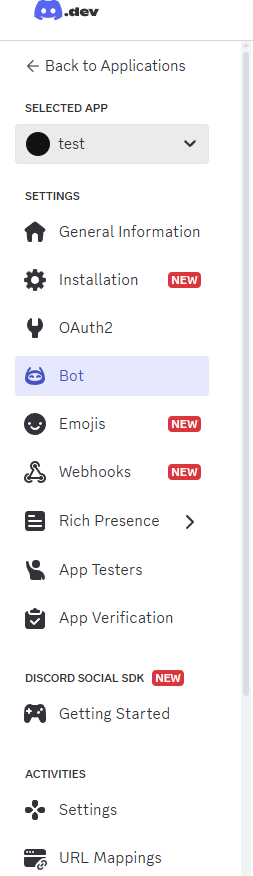
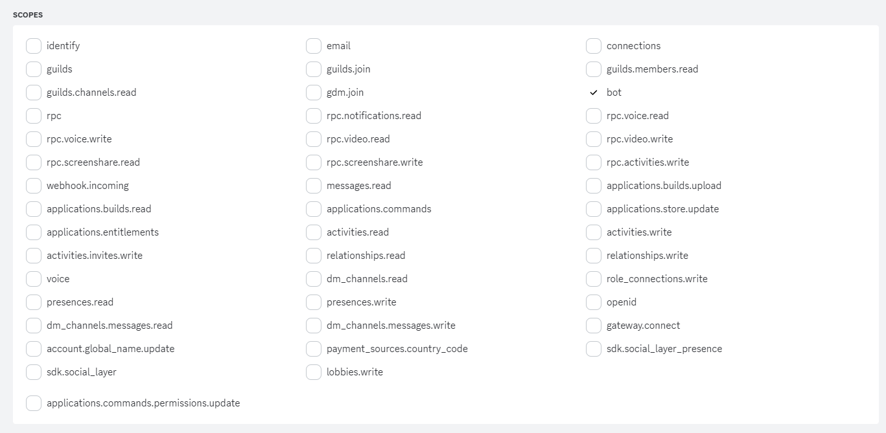
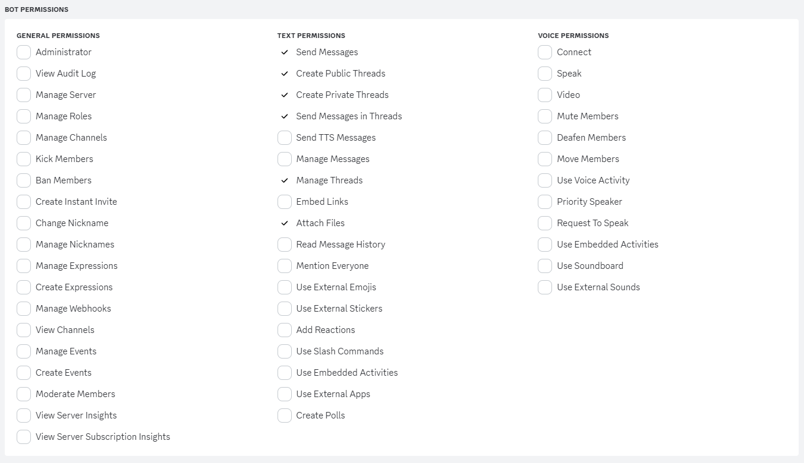
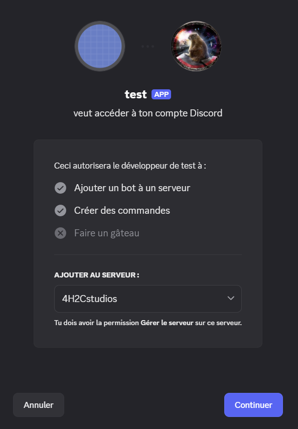
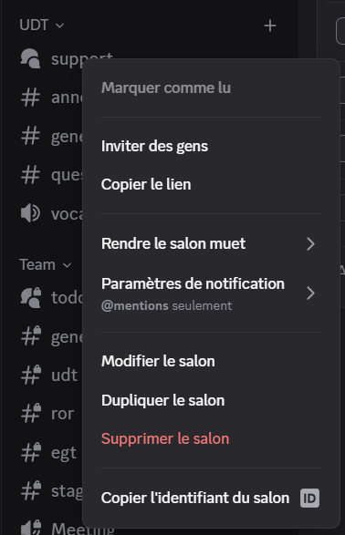
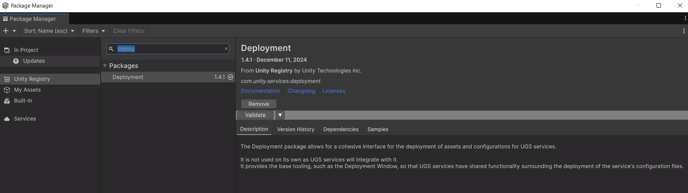
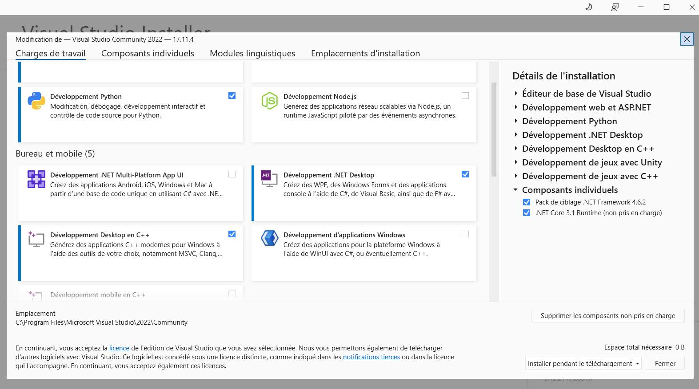
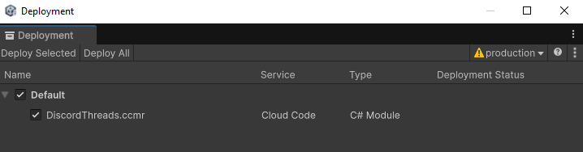

# Set Up the Discord Bug report

<div style="border-left: 4px solid #4CAF50; background: #f0fff4; padding: 0.75em 1em; margin: 1em 0;">
  🆕 <strong>Introduced in version 1.4</strong>
</div>

<div style="border-left: 4px solid #ffa500; padding: 1em; background: #fff8e1;">
  <strong>Disclaimer:</strong><br>
Setting up Discord is a bit harder then Trello. The main reason is that Discord's Token are too powerful. One need to protect the token such as your user cannot abuse it. 

As a consequence the request have to go through a relay server. For the sake of simplicity we chose to use the Unity's Cloud Code Service. In term of pricing it goes for 1 000 000 free request per month and 0.5$ per supplementary million. If you feel like your project is going to need more, reach out to us so we could make a custom AWS implementation just for you.

Also discord is limited to 50 messages per second per bot.
</div>

Let's do it step by step.

## Step 0
You need a discord server, that you administrate. This server needs to be a community sever, where you can create forums.

## Get a discord bot token
This step is pretty easy. But beware to set the settings right. 
Go to this adresse : https://discord.com/developers/applications and click on the New application button at the top right of the page. 

Give it a name that makes sens to you, agree to the term of services, click submit and confirm that you are not a robot

Please remember that you can get your application ID and your public key on the page of the discord bot that has just been created.

<div style="display: flex; align-items: flex-start; gap: 1em; margin: 1em 0;">
  
  <div>
    <p>In the bot token panel you can get your token. Click on reset token to have your first token. Copy this token in a bloc note, and never share it with anyone, never ever, ever !!</p>
    <p>Now get in the OAuth2 Section (In the left navbar) and get down to the OAuth2 URL Generator.</p>
  </div>
</div>





It should have generated an URL for you. Copy and paste this URL in your browser.
This screen should open in your discord APP.


Select the server you want to add the bot to. Just Accept.

## Get the forum ID

<div style="display: flex; align-items: flex-start; gap: 1em; margin: 1em 0;">
  
  <div>
    <p>Its really quick first put your discord account in dev mode. </p>
    <p>Then go to the forum, right click and copy the ID. </p>
  </div>
</div>

## Configure the C# cloud module
Ok now this is the tuff part. You are going to do some cloud code and use the unity services.

<div style="border-left: 4px solid #ffa500; padding: 1em; background: #fff8e1;">
If you already use the Authentication service in your project you might want to change a bit the implementation. (Just remove the authentication from the Discord API script)
</div>

Normally both cloud code and authentication got installed as dependencies of the debug toolkit. If they didn't you might already know it (error messages). Please install them.

Then you have to install Unity's Deployement package, from the package manager. 



Now you've got to install .Net on your computer. Go in your visual studio installer and click on modify the install and add the .Net dev.



Make sure your projet is connect to Unity services. ProjectSettings > Services. If you don't have a unity project ID. Please get one.

In the folder 4Hands2Cats/DebugToolkit/ReportForm/CloudModules/DiscordModule click on the DiscordThread Asset and in the inspector click on generate solution. It should compile for a few minutes (basically it create yet another C# project in visual studio). 

Now go to the project and replace the sample script by this one and replace the Token by the token of your bot and forum channel id by the one of your forum.
You should rename the sample script like : DiscordThreadCreator.cs.

```csharp
using System.Net.Http;
using System.Text.Json;
using System.Text;
using System.Threading.Tasks;
using Unity.Services.CloudCode.Core;
using System;

namespace DiscordThread;

public class DiscordThreadCreator
{
    private readonly HttpClient client = new HttpClient();

    [CloudCodeFunction("PostToDiscordForum")]
    public async Task<object> PostToDiscordForum(string title, string description, 
        string imageFileName, string imageMimeType, string imageBase64, 
        string textFileName, string textFileMimeType, string textBase64)
    {
        // Please make sur you never push to a public repository with your Discord Bot Token hardcoded.
        var discordBotToken = "YOUR_TOKEN"; 
        var forumChannelId = "YOUR_FORUM_ID";

        var url = $"https://discord.com/api/v10/channels/{forumChannelId}/threads";

        var payload = new
        {
            name = title,
            auto_archive_duration = 1440,
            message = new
            {
                content = description
            }
        };

        var json = JsonSerializer.Serialize(payload);

        var content = new MultipartFormDataContent();

        var imageBytes = Convert.FromBase64String(imageBase64);
        var imageContent = new ByteArrayContent(imageBytes);
        imageContent.Headers.ContentType = new System.Net.Http.Headers.MediaTypeHeaderValue(imageMimeType);
        content.Add(imageContent, "files[0]", imageFileName);

        var textFileBytes = Convert.FromBase64String(textBase64);
        var textFileContent = new ByteArrayContent(textFileBytes);
        textFileContent.Headers.ContentType = new System.Net.Http.Headers.MediaTypeHeaderValue(textFileMimeType);
        content.Add(textFileContent, "files[1]", textFileName);

        content.Add(new StringContent(json, Encoding.UTF8, "application/json"), "payload_json");

        var message = new HttpRequestMessage(HttpMethod.Post, url);
        message.Headers.Add("Authorization", $"Bot {discordBotToken}");
        message.Content = content;

        var response = await client.SendAsync(message);
        var resultJson = await response.Content.ReadAsStringAsync();

        if (!response.IsSuccessStatusCode)
        {
            return new { success = false, error = resultJson };
        }

        using var doc = JsonDocument.Parse(resultJson);
        var threadId = doc.RootElement.GetProperty("id").GetString();
        var guildId = doc.RootElement.GetProperty("guild_id").GetString();

        return new
        {
            success = true,
            threadId,
            url = $"https://discord.com/channels/{guildId}/{threadId}"
        };
    }
}
```

Ok now get back to Unity and open the deployment window : Services > Deployment (it's in the top bar of Unity).

Fill it like on the image, and click on Deploy Selected.


## Test it out
Go in the Demo scene. Select the UDTReport in the hierarchy and set the report manager's Report Target to Discord. 

Now launch the scene and test it out. >Reminder : F11 to open the bug report form.

<div style="border-left: 4px solid #ffa500; padding: 1em; background: #fff8e1;">
  <strong>Note:</strong><br>
If you encounter any issue please contact support in the discord server.
</div>