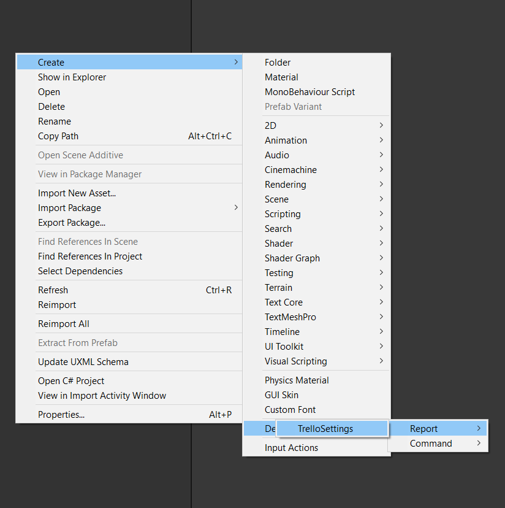
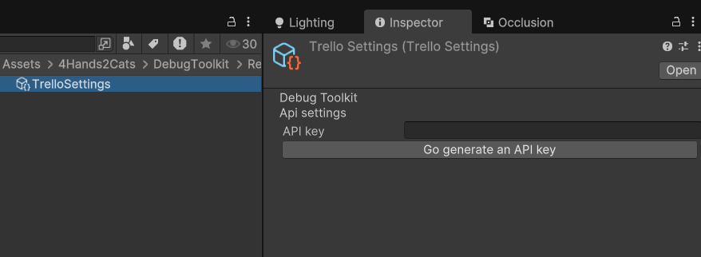
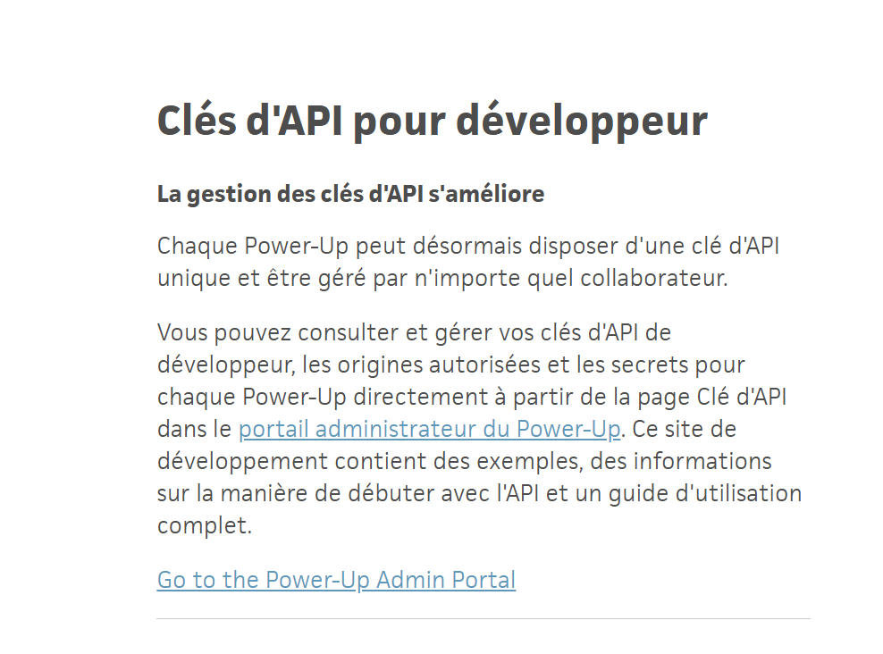
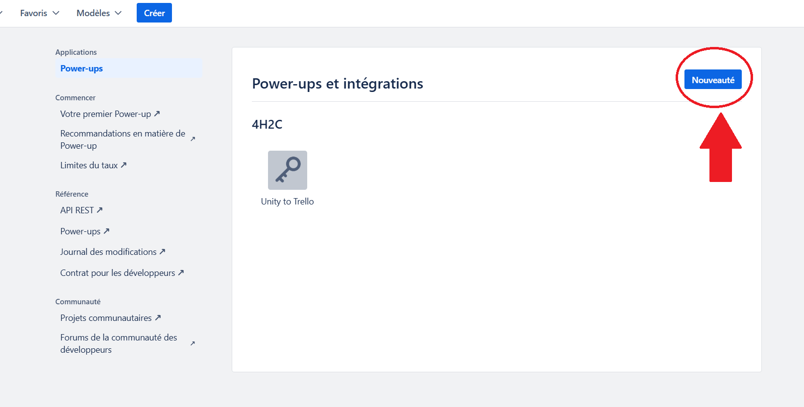
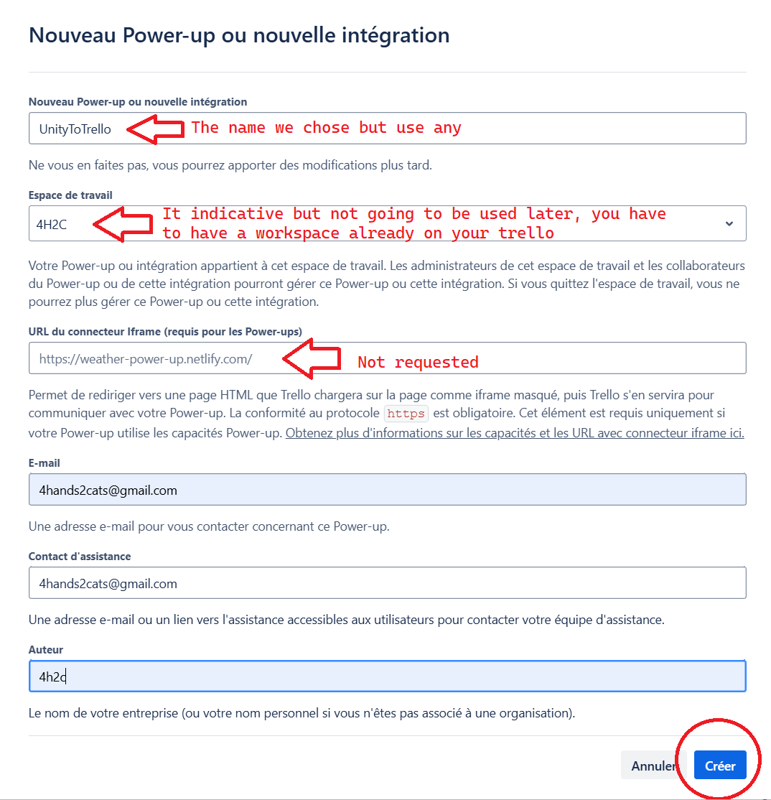
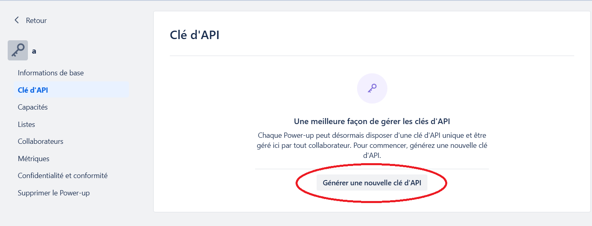
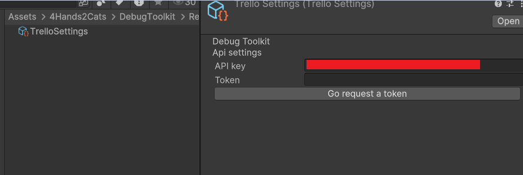
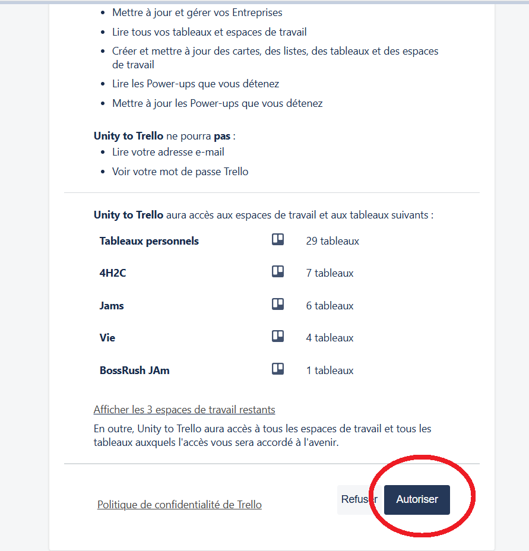
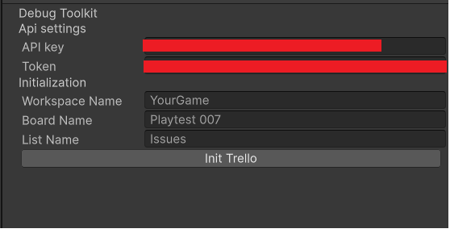

# Set up your board

> Introduced in V 1.3

The set up is really guided thanks to a custom inspector. The main idea is to store your board information in a scriptable object. Thanks to this process you can have multiple boards for your project. Maybe you want each playtest to have its own board. 

For this par you are going to need a Trello account. Since your API key and Token are going to be present in your build we most advise to make a new account for the debug toolkit.

## Step 1 : Create the scriptable object
Right click and create the SO

## Step 2 : Set up you API key

Click on the Go generate an API keybutton. It'll open the Trello website. If you are not connected or don't have a trello account you are going to have do both.

Here click on the blue hightlighted text.

You are going to need to click on the top right button, to create a new power up. On this screenshot we already created ours. You need yours.

Now just fill the form and click on Create

Now generate your API key 

Copy the API key you just go on the scriptable object in unity. 

## Step 3 : Get your token
Don't worry its way faster than getting the API key. 

Now that you've entered your API key, the scriptable object changed and gives you a button to request the Token. Click on the button Go Request Token.

You'll get to a trello page where they ask you if you allow your power up to communicate with the boards related to your account.
Just allow it !! 

You are going to be redirected to a page for your token. Just copy past it to your scriptable object in unity.

## Step 4 : Init the board
This is the last step !! 

Name your Workspace, board and the list where the bugs are going to be reported. And press Init trello. You should see some messages in the Unity consol. If you get any error please contact support on the discord.

