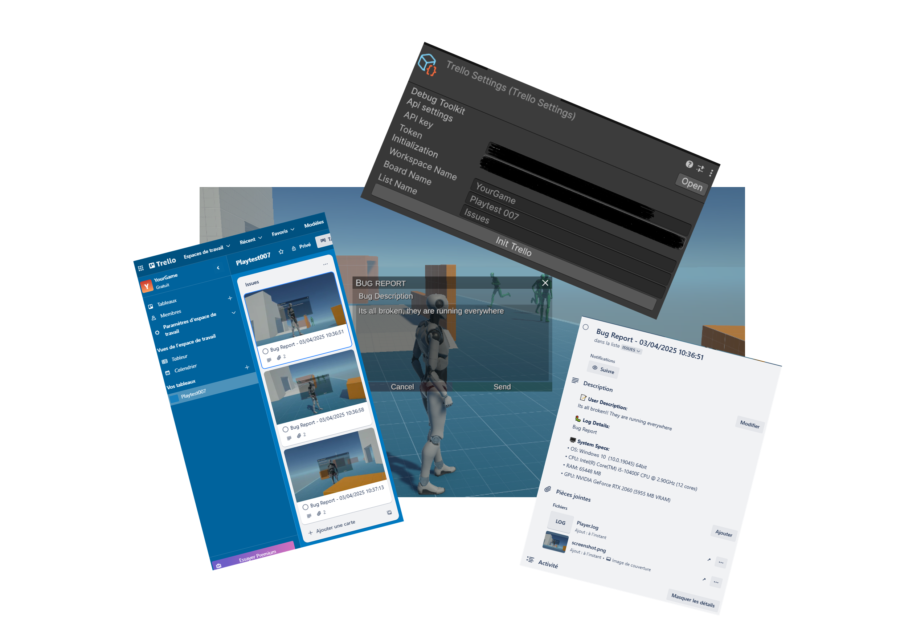

# Bug Report

  🆕 <strong>Introduced in version 1.3</strong>

Thanks to this feature you can send tickets to a board. The system supports both Trello and Discord. We are planning to extend to Jira, Notion, CardDeck and Azure. Just tell us and we'll add it for you !!

This section is all about guiding you through the process of setting up your project to enable the Trello or/and Discord

As always we listen carefully to your feedbacks and we'd love to improve the feature based on those !! 

