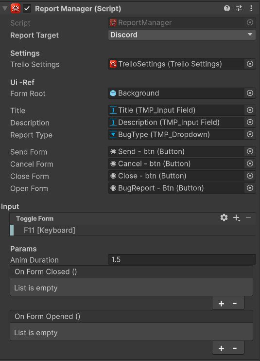

# Enable the feature

  🆕 <strong>Introduced in version 1.3</strong>

To enable the feature you need to add the UDTReport-Canvas prefab in your scene.
Then you need to reference your TrelloSettings in the Report manager of this prefab. 

There is a dropdown menu of the report manager select the Report Target you've set up. 

<strong>Note</strong>
You can change the Trello settings to interact with multiple boards. 

