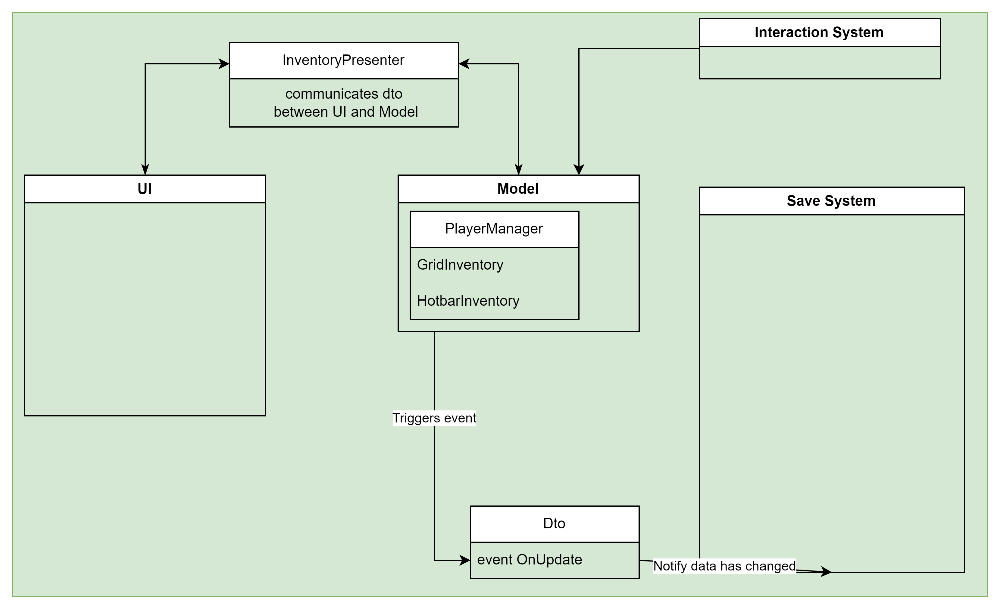

## 🧱 Architecture Overview
The Inventory Toolkit is built on a clean and modular architecture composed of three main layers:

- UI
- Model
- Data

Each layer is decoupled and communicates using Data Transfer Objects (DTOs). This design allows for easy replacement and customization of parts like the save system, which is non-invasive and fully modular. If you're considering integrating your own save solution and aren't sure where to start, feel free to reach out on our Discord server!

The interaction system connects to the PlayerManager, which acts as a central relay between the player's actions and the inventory system.

The UI and Model are fully decoupled using a ScriptableObject-based presenter, following the Model–View–Presenter (MVP) pattern.

## 🟢 How to Enable the Inventory System

Check out the demo scene included in the package. You'll notice two key objects in the hierarchy:

- PlayerManager
- UI

## 🎮 Try It Out (Demo Scene Walkthrough)

Here's a simple demo scenario to get started:

Run the scene your character should be able to move around (based on a slightly modified third-person controller).

1. Try opening the door.
2. Pick up the lamp on the left side.
3. Press I to open your inventory.
4. Drag and drop the lamp into the hotbar.
5. Use number keys (e.g. 1, 2, 3, ...) to equip the lamp.
6. With the lamp equipped, use it to find the key on the right.
7. Equip the key from your inventory.
8. Walk to the door again with the key equipped—and open it.

___ 

🎉 Congrats! You’ve opened the door.

Feel free to explore the scene! Each interactable item has its own logic through custom interaction components. Right now, there are only two built-in types, but we’re actively expanding the toolkit.

👉 Want to see more interaction types? Join the Discord and share your ideas!