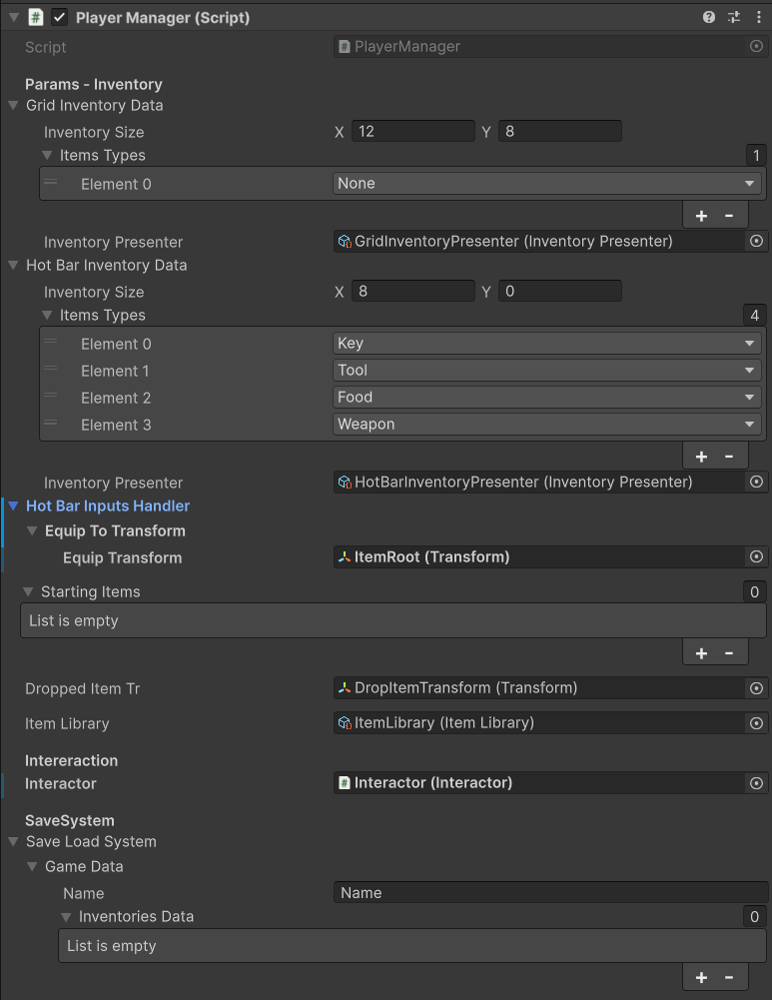

The Player Manager is the main component of the toolkit. It's a MonoBehaviour that acts as the central hub between the UI, the inventory model, the save system, and the interaction logic.

## 🧩Inspector overview

From this inspector, you can configure and control everything related to your inventory setup:



From top to bottom, you'll find:

- A reference to the inventory prefab (used to spawn the inventory logic).
-The UI Presenter ScriptableObject, which handles communication between the UI and the model.
- A section for input keys — used to control the hotbar and inventory actions.
- A list of starting items to pre-populate the inventory at runtime.
- A reference for where items are dropped in the world when removed.
- The Interactor, which handles in-world interactions (like picking up items).
- The Save System, with quick save/load buttons for testing.

Everything here should already be set up if you're using the demo scene. If you're adding this to your own setup, just drag in the proper references and you're good to go.

## 👨‍💻Code overview
We are just going to focus on the player manager. If you need more information about the rest of the code base do not hesitate to request some more documentation or help in the discord server.

So on awake it initializes the save system and binds to the the interaction system. 

```csharp
    private void Awake()
    {
        interactor.OnInteract += Interactor_OnInteract;
        saveLoadSystem.Init();
        saveLoadSystem.NewGameFile();
    }
```

Each time the interactor interacts it handles the different kinds of interactions. Notice that those interactions are notifying the Player manager, but the are also doing things on their ends.  

```csharp
    private void Interactor_OnInteract(IInteractable obj, Action interaction)
    {
        switch (obj)
        {
            case GrabItemInteractable grabItemInteractable :
                if (grabItemInteractable.Payload is IItem item)
                {
                    _gridInventory.AddItem(item, interaction, null);
                }
                break;
            case UseItemInteractable useItemInteractable:
                if (useItemInteractable.Payload is IItem itemToUse)
                {
                    var activeItem = _hotBarInventory.CheckIfIsActiveItem(itemToUse);
                    if (activeItem != null)
                    {
                        interaction?.Invoke();
                        if (useItemInteractable.ConsumeItem)
                        {
                            _gridInventory.RemoveItem(activeItem, null, null);
                        }
                    }
                }
                break;
        }
    }  
```
On the start we Initialize everything using all the data set up in the inspector. The inventories are not mono behaviours. You can add as many instancies as you wish. You are not forced to have a user interface to store items in your UI. You can use the base class Inventory if you want a vanilla data structure that is handled by the save system already. 

There is a dependency system. If you add a dependency to an inventory it means that every changes will be cascade to their dependency. Don't make cyclic dependency.

```csharp
        private async void Start()
        {
            _gridInventory = new GridInventory(gridInventoryData.InventoryPresenter, gridInventoryData.InventorySize, gridInventoryData.ItemsTypes);
            _gridInventory.OnItemDrop += GridInventory_OnItemDrop;

            await Awaitable.NextFrameAsync();

            for(int i = 0; i< startingItems.Count; i++)
            {
                _gridInventory.AddItem(startingItems[i].Item, null, null);
            }

            _hotBarInventory = new HotBarInventory(hotBarInventoryData.InventoryPresenter, hotBarInventoryData.InventorySize.x, hotBarInventoryData.ItemsTypes);
            hotBarInputsHandler.Init(_hotBarInventory);

            _gridInventory.AddDepency(_hotBarInventory);
        }  
```

Now only the binding with the save system left to do. There are two methods : Save and Load. The save system uses the principle of the data binding. GameData, InventoryData, etc ... are only known from the save system and the Player Manager. The reste of the system uses Dto. Its a bit of a duplicated data behaviour but it also leave you with the possibility of using your save system of choice if you wish.

Saving is really easy  : one just binds the dtos of the inventory instancies to the save system. Now everytime there is a change the save system knows about it. It saves a load on saving performance.

Don't forget to call save to save when needed.

```csharp
    private void SaveInventory()
    {
        SaveLoadSystem.Instance.BindDto(_gridInventory.GetInventoryDto());
        SaveLoadSystem.Instance.BindDto(_hotBarInventory.GetInventoryDto());
    } 
```
Loading is tougther : there is an order to respect You need to load your inventories in there dependency order. The grid depends on the hot bar. So first load the grid and then the hotbar. The system binds the dtos of the inventories once more.

```csharp
    private void LoadInventory()
    {
        var data = SaveLoadSystem.Instance.LoadGame("NewGame");
        var gridInventoryDto = data.GetInventoryOfType(EInventoryType.Grid);
        if (gridInventoryDto != null)
        {
            foreach (var itemDto in gridInventoryDto.Items)
            {
                itemLibrary.MatchAndUpdateItemDtoBySO_ID(itemDto);
            }
            _gridInventory.LoadFromDto(gridInventoryDto);
        }
        else
        {
            Debug.Log("No Grid Inventory found in saved data.");
        }

        // Loaded after the grid because the grid control the hotbar in the currrent set up
        // You can change the dependencies, or create new ones but beware of the loading order
        var hotBarInventoryDto = data.GetInventoryOfType(EInventoryType.HotBar, gridInventoryDto.Items);
        if (hotBarInventoryDto != null)
        {
            _hotBarInventory.LoadFromDto(hotBarInventoryDto);
        }
        else
        {
            Debug.Log("No Hotbar Inventory found in saved data.");
        }
    }
```

In the next section you'll learn about how to create new items for your project.