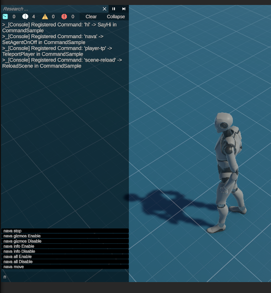

# Command Prediction

  🆕 <strong>Introduced in version 1.3</strong>

This feature makes navigation in the console easier. 

To use it just open the console, and start typing. The console will show you any possibilities. 

The complexity is related to the length of the commands and not to the total amount in the project. Any command you make are going to be automatically supported by this feature.

- You can click on the commands to select it.
- You can navigate using the UP and DOWN arrows. When navigating using the arrows you can use the RIGHT arrow to select the command. 

When a command is selected it appears in the console, you can either complete it or just execute it pressing enter.

