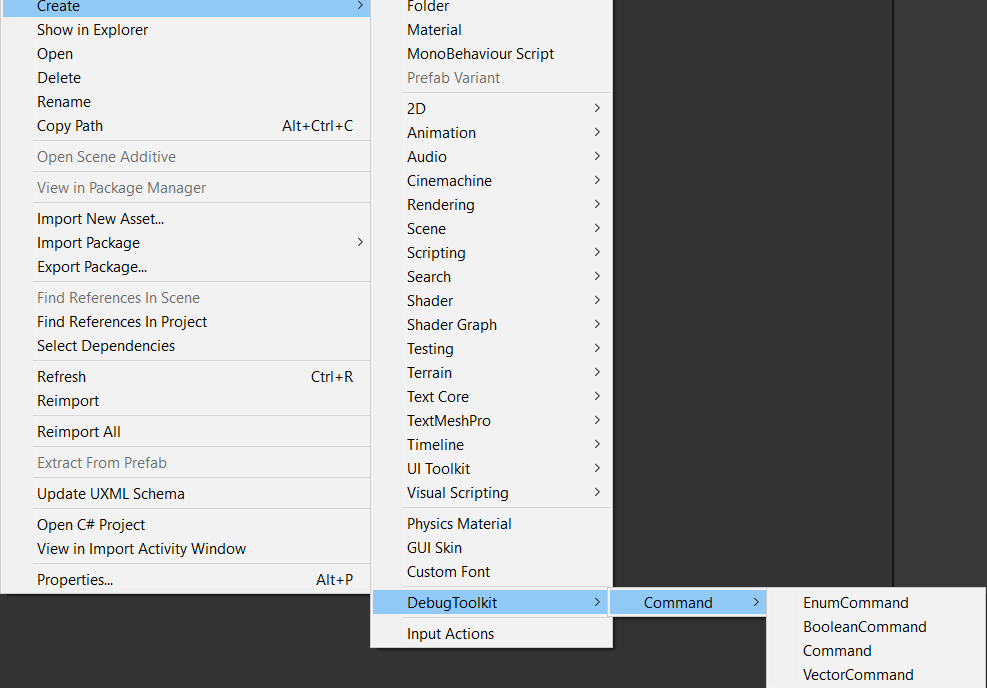
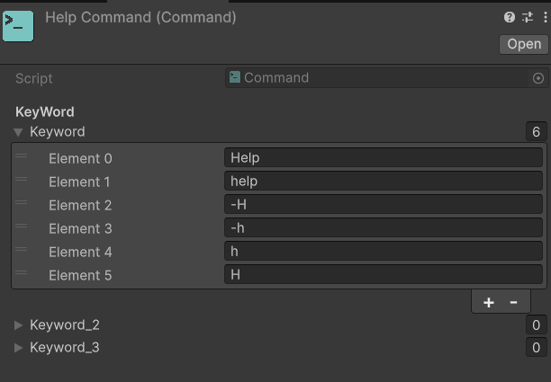
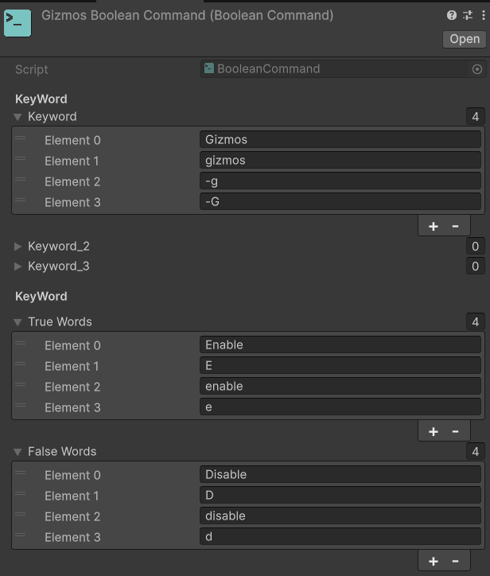
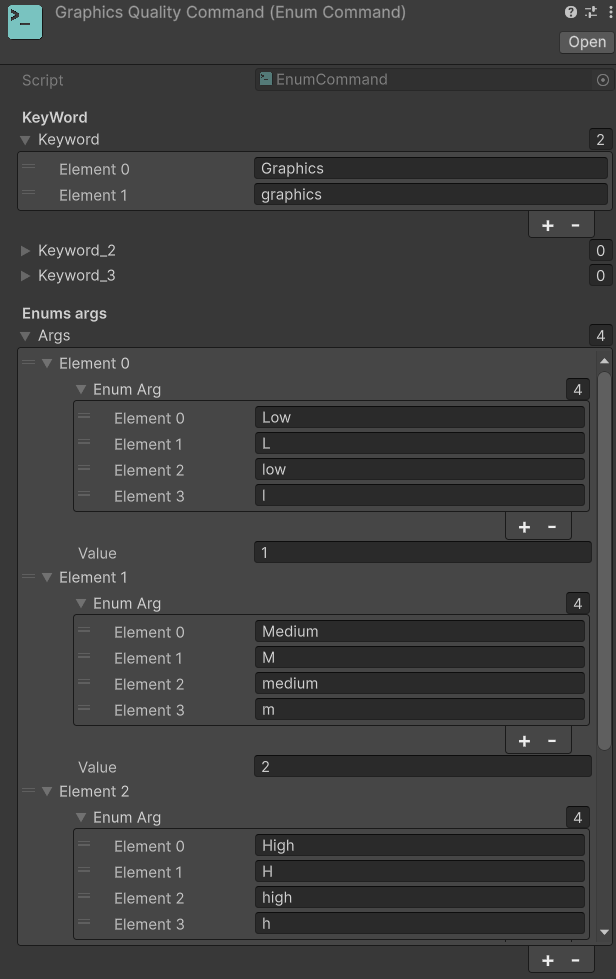
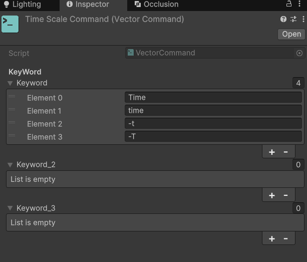
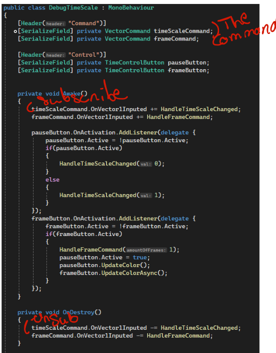

# Make your own commands

The command system is based on scriptable objects. Scriptables object are really practical to use because they are Gameobject and scene agnostic.

We are planning on making an API to create commands using C# attributs which'll give you two options to create your console commands.

___ 

You can create like this 

___

There are four type of commands : 
-   The **Command** is the most basic one it is used to simply inputs a chain of up to three words that would send a signal of type => Command Got Activated. This is the one which is used for the help command per example.  
   

- The **Boolean Command** which takes two arguments to send either a signal activate or deactivated (true or false). This used for the Gizmos command per example. You've got the main keywords and then the keyword for true and the keyword for false. 
  

- The **Enum Command** which take n arguments to send a signal between 0 and n - 1. Its your job to handle what those index mean. You can bind those index with a keyword each so its easier to use in the in game console. This command is use in the Graphic Quality Command per example.
  

- The **Vector Command** which takes as an argument of size 1 to 4, so basically a float, a Vector2, a Vector3, or a quaternion. It has four signals, one four each vector size. Its used for the timescale command per example.
  

___

So now you now how to make a command but there is a need for a bit more set up. First you need to add this command to the interactive console component in the UDTConsole-Canvas prefab.

Now there is only one thing left for you to do : connect this command to a script of your choice. Once again this is pretty straight forward. To show you how to do it we are going to take a look at the **DebugTimeScale** script which is in the sample folder. 

To be able to bind a command to one of your script you need to add the **DebugToolkit.Console** assembly to the assembly of your script. 

Then in the script you need to :
- get a reference to the command you've create (you can use the resources folder or the addressable package to avoid some clicks in the inspector, here we used a serialized field).
- subscribe to the event of your choice (depending on the type of command). 
- not forgetting to unsubscribe onDestroy to avoid memory leaks (pro tip : some times unity dosen't calls the OnDestroy correctly when you stop the play mod so don't forget to add a *if(this==null)return*)).

___

<strong>Note</strong>
You can find the existing commands used in the toolkit the 4Hands2Cats/DebugToolkit/Console/Interaction/CommandData folder.

