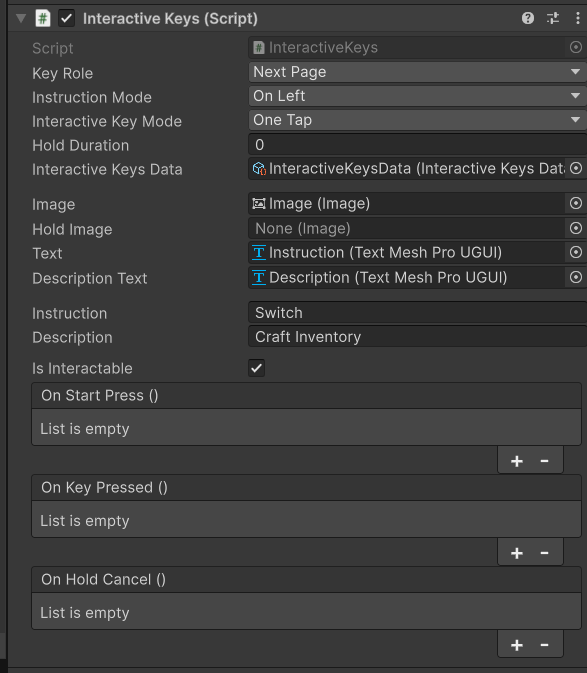

Bindable buttons are UI buttons that can be linked to keys, mouse buttons and controller buttons. 

In this section you are going to learn how to use them. 

This is an important feature if you want your UIs to feel usefull and to provide the user experience you might want to consider use them. 

Not they are fully controller compatible and will always show the right prompt depending on the device (with some configation but you'll learn about that a bit later).

# How to use them
First I would advise you to take a look at the BindableButtons demo scene. 

