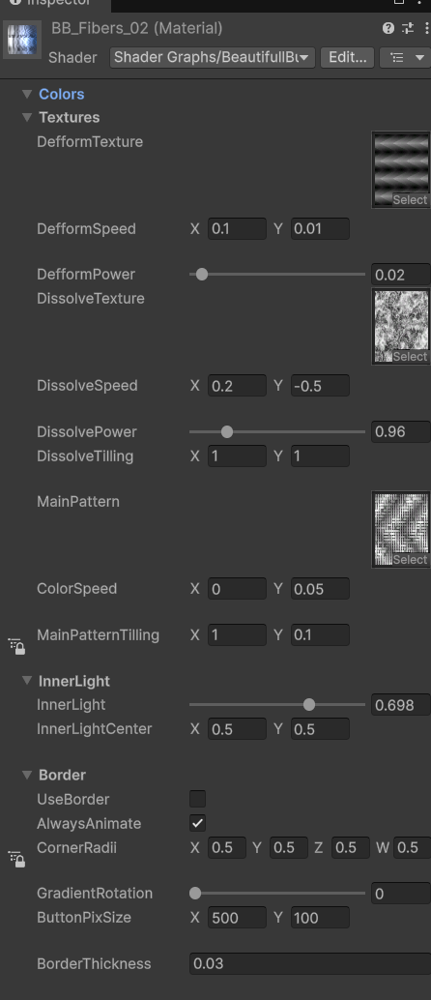

## The component
The **Custom Button** is a component that works like a normal button. It exposes all the button life cycle events with Unity events. 

The button requires a Material to work. You should use or make a varient of one of the BB_Materials (ex : BB_Fibers_02).

The good thing with those buttons is that since they are shader based you can go wild without ever suffering in terme of performances.

Use Nav : Enables the navigation
IsInteractable : Makes the button interactable
AutoMatVar : Lets the button handle the material of the image. If you want to swap the mat at runtime using another scipt, just untick it.
Selected On Click : Select the gameobject of the button when clicking on the button.

Don't forget to set up your menu theme to choose the gradients that are going to be applied to the buttons.

## The shader
The shader of the buttons is based on the Pattern, Distort and Dissolve traditional Vfx shader.

The textures can be mixed and match to make unic effects. Basically the Defform texture is modifying the UV of the Pattern Texture and the dissolve texture is erasing some areas.

Don't go to insane on the defform power is you want your pattern to be recognizable. 

All the textures can scroll, modify the speeds to have unic effect. Always try to have all the texture going at different speeds for more interesting effects.

The inner light is a simple diamond mask acting like a Vignette effect. 

You can enable and control the shape of the borders of the button. Note the CornerRadii are also impacting the base button shape

The framework allows to make two colors gradients you can control its orientation with the Gradient Rotation (Get crazy and animate that with a script for more impressive effects).

The button pix size should be the one of your anchored delta size (the ratio is the important thing).

Have fun !!