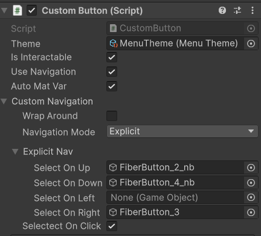

The navigation of the framework is custom. The main reason is that the original buttons of unity do not give control over the state of the button and the shaders. The secondary reason being that I don't like the selectable framework that has a huge impact on performances (I mean for UI).

The navigation system requires the addition of the **InputDeviceManager** on the game object that has the event system.

For now the navigation only supports Explicit mode. It means that you just have to fill the Explicit Nav with your navigation targets.

If you want to navigate from one of the beautiful components to a selectable you just have to fill the Nav. 

If you want to navigate from a selectable to to a beautifull component you have to add a **Selectable Navigation Binder** component on the same gameobject as your beautifull component.  

Make sure to tick the Usenavigation and IsInteractable