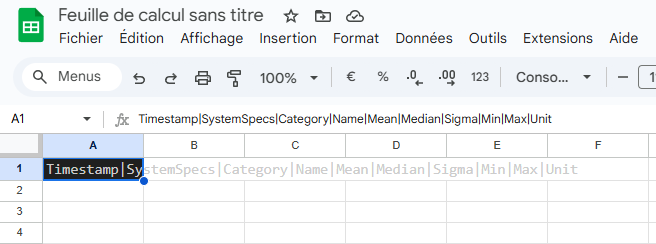
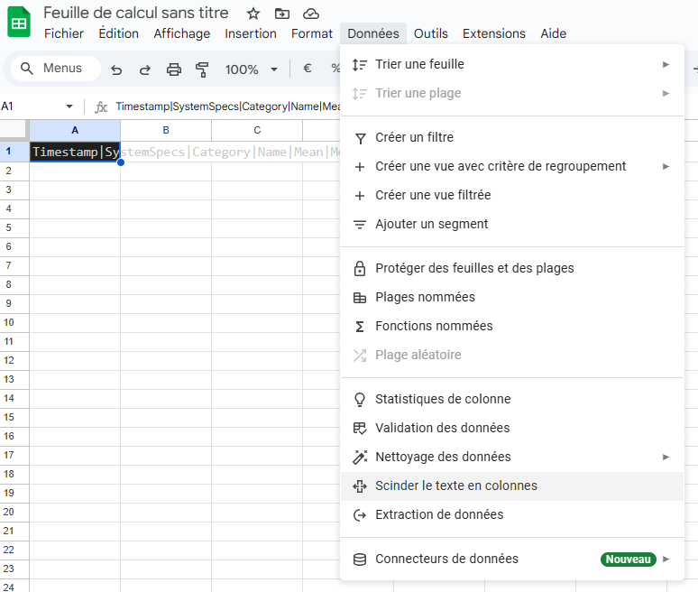
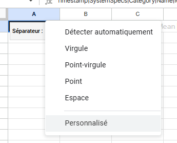
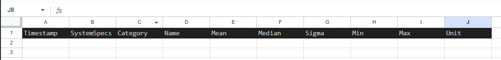
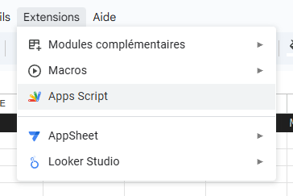
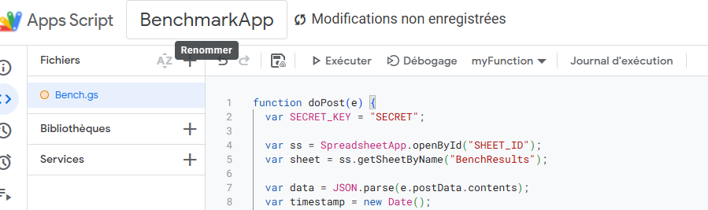
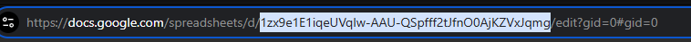
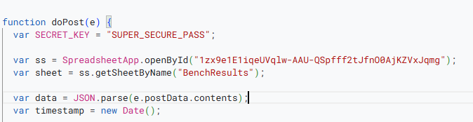

<div style="border-left: 4px solid #4CAF50; background: #f0fff4; padding: 0.75em 1em; margin: 1em 0;">
  🆕 <strong>Introduced in version 1.42</strong>
</div>

There is a little of preparation before using this package. On this documentation page you are going to learn how to deploy a web app on your google drive, how to call it using a Unity Web Form, how to link the web app to an excel sheet and how to launch a benchmark in your game. 

-- That's a lot--

-- Don't worry it's going to be Ok -- (~15 min to do the set up)

## Getting the blank sheet
Just [create a new google sheet](https://docs.google.com/spreadsheets/u/0/), on a google account.

Then copy past this in the first cell of the sheet : 
Timestamp|SystemSpecs|Category|Name|Mean|Median|Sigma|Min|Max|Unit



Then with the cell selected, go to Data > Separate the text in collumn



Select Personalize  



and enter |.

It should look like that 


## Setting up the web app
Congratulation your excel is ready to be used !! 

Now go to Extensions > AppScript 



It'll get you to a new window. 
Name your app as you wish and your script as you wish (BenchmarkApp is a great name).

Copy the following .gs script to the script of your web app. 

```js
function doPost(e) {
  var SECRET_KEY = "SECRET";

  var ss = SpreadsheetApp.openById("SHEET_ID");
  var sheet = ss.getSheetByName("BenchResults");

  var data = JSON.parse(e.postData.contents);
  var timestamp = new Date();

  if (!data.secret || data.secret !== SECRET_KEY) {
    return ContentService.createTextOutput("Unauthorized").setMimeType(ContentService.MimeType.TEXT);
  }

  sheet.appendRow([timestamp, data.systemSpecs]);

  data.FrequencySets.forEach(function(item) {
    sheet.appendRow([
      "","",
      "FrequencySets",
      item.Name,
      item.meanValue,
      item.medianValue,
      item.sigmaValue,
      item.minValue,
      item.maxValue,
      item.Unit
    ]);
  });

  data.MemorySets.forEach(function(item) {
    sheet.appendRow([
      "", "",
      "MemorySets",
      item.Name,
      item.meanValue,
      item.medianValue,
      item.sigmaValue,
      item.minValue,
      item.maxValue,
      item.Unit
    ]);
  });

  data.GCSets.forEach(function(item) {
    sheet.appendRow([
      "", "",
      "GCSets",
      item.Name,
      item.meanValue,
      item.medianValue,
      item.sigmaValue,
      item.minValue,
      item.maxValue,
      item.Unit
    ]);
  });

  sheet.appendRow([]);

  return ContentService.createTextOutput("OK");
}
```

It should look like that : 


## Binding the spread sheet to the web app

Great job !! 
You might notice that on the script there is a field called SECRET. Fill it with a random password. We are going to use this secrete later in unity. It is here to add a bit of security to the web app.

Now let's replace the SHEET_ID by the id of your google sheet. 
You can get this id in the url of your google sheet. 
Mine is like that 


You should have something similar to that on your web app 


## Deploy the web app

Your app is ready for deployment. 
Just click on the button at the to right of the screen. 

Select new Deployment.

For the App type select : Web App
For the description enter : Whatever
For the execute as select : Yourself
For the access select : everyone

Now click on deploy.

Authorize the access.

Connect with your google account.

You'll get a warning saying google didn't verified the app. Just go in the small underline bottom left "advanced" button and click on "Go to BenchmarkApp(unsafe).

On the next panel click on Allow.

On the next panel you should get a deployment URL. Copy it to safety you are going to need it for later.

## Binding the web app to the unity project

We are almost there !! 

lets get to the debug toolkit in unity. Look for a configuration file (scriptable object) named : "BenchmarkConfig".

Fill your SECRET_KEY and the deployment URL in the SecretKey and the SheetExporterUrl respectively. 

## Using the benchmark tool

Find the prefab UDTBenchMark in the project and drag and drop it to the scene. That's it. (Notice in the Demo scene the prefab is already added).

Now press play. 

In play mode you've got a new button on the bottom right. Just click on it. 

Once the benchmark is finished just take a look at your google sheet. It should have received data (it takes 10 to 30 sec). 

If it didn't ... well contact us on discord :D 

___ 
Thanks for using the benchmark package !! 
If you have any issue or suggestions be our guest and tell us on the discord of the tool !! 
