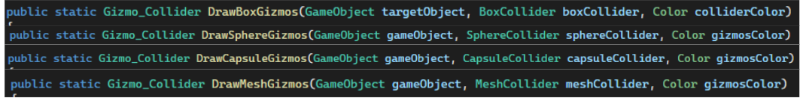

# Gizmos Api

You can create and delete gizmos at runtime using the Gizmos API.
> Note : this APIs might change depending on your feedback. Make sure to come back to this section if your logic breaks. 

For now there only is an API for the Collider Gizmos, but we are planing on completing this so you can use it for raycasts to.

You've got four static methods to work with. The first argument is always the game object you wish to add the Gizmos Collider to. The second argument is the corresponding Unity Engine collider component and the third one is the color you wish to use. 

The Gizmos will spawn at the position of the collider and look exactly the same, but will work at runtime.

___ 
We plan on completing this API, and 2d collider support. 