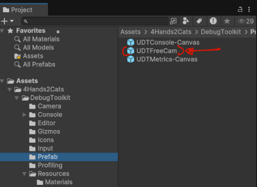

# Free Cam

The free cam is here to give you a tool that's similar to the navigation in the scene panel of unity, but at runtime. 

To use type *freecam*/*Freecam* followed by *enable* or *disable* to enable or disable the freecam in the console after opening it using **F12**. 

Though this embeded in the package, the freecam comes as stand alone feature. Feel free to use it for your gameplay if you want. 

Future versions of the cam should be compatible with cinemachine.

The prefab for this one is in the same folder as the console.  

To use as a stand alone feature just drag and drop the prefab in your scene.

<strong>Note</strong>
If you use it as stand alone feature it'll not be control anymore by the console.

