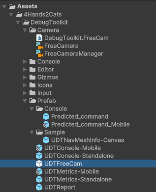

# Free Cam

The Free Cam provides a runtime navigation tool similar to Unity’s Scene view controls.

🚧 <strong>Future versions</strong> of the Free Cam are planned to support Cinemachine.

## Where to Find It

### Instantiation via UD Console

To use it, type `freecam` or `Freecam` followed by `enable` or `disable` in the console after opening it using **F12**.

### Using as a Prefab

Although embedded in the package, the Free Cam is also available as a standalone feature.  
Feel free to integrate it into your gameplay directly.

The Free Cam prefab is located in the same folder as the console prefab.

To use it as a standalone component, just drag and drop the prefab into your scene.

<strong>Note:</strong> If you use it as a standalone feature, it will no longer be controlled by the console.

## How to Use It

The controls are similar to those in the Unity Scene view:

- Hold **Right Mouse Button** to enter fly mode.
- Use **W/S** to move forward/backward (Z axis).
- Use **A/D** to move left/right (X axis).
- Use **Q/E** to move down/up (Y axis).
- Move the mouse to rotate the camera.
- Hold **Shift** to sprint.
- Use the **Mouse Scroll Wheel** to adjust speed.

You can also incrementally move forward using the scroll wheel **without** holding the right mouse button.

---

### Customizing Controls

You can easily modify the controls using the `DebugToolkit_IA` (Input Action):

---

### Modifying Parameters

Adjust Free Cam parameters directly on the prefab:

