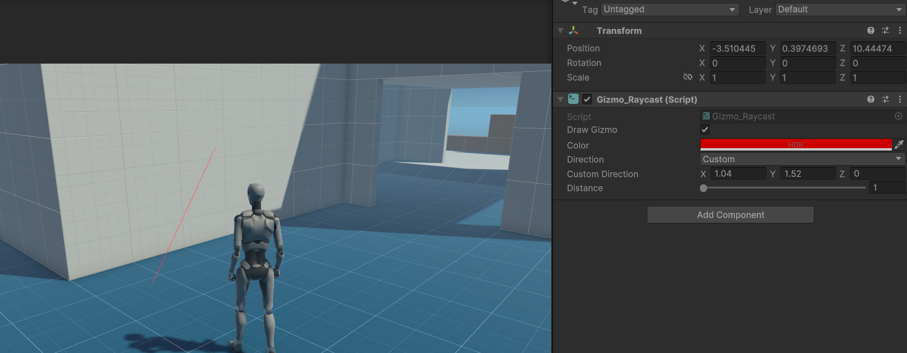

# Gizmos

As you now there is already an API in unity to draw gizmos for debugging purposes. But you cannot draw gizmos for run time. Those gizmos are harvesting the power of the **GL** API to show performance friendly gizmos at runtime for quite anything. 

There are two way of using the gizmos. Manual and automatic using the console. 

- The manual way consist of adding the gizmos components to your gameobjects
- The automatic way is used to show all colliders in the scene. To show all colliders simple type the command : *Collider*/*collider*/*-c*/*-C* followed by *enable*/*e* or *disable*/*d* to enable or disable the in game gizmos rendering for the collider (beware on large scene there might be a small freeze when enabling). This command also activates all the other in game gizmos [going to change in next version] int the ingame console.

Gizmos that are manually setted up can are still managed by the ingame console. Simple type : *Gizmos*/*gizmos*/*-g*/*-G* followed by *enable*/*e* or *disable*/*d* to enable or disable the in game gizmos.

> Note : this commands would also hide the collider gizmos. We are awaiting for you feedback to improve this feature. 

To set up a Gizmos as component simple add the choosen Gizmos to your gameobject.

____
Use the gizmos Collider to choose show a collider like shape. 

There are four options : 
- The **Box**, that you can control using the **Size** and the **Center** parameters
- The **Sphere**, that you can control using the **Radius** and the **Center** parameters
- The **Capsule**, that you can use using the **Radius**, the **Center** and the **Height** parameters
- The **Mesh**, that you can use by drag and dropping a mesh in the mash container of the gameObject. [To enable this feature you need to enable Read/Write on your meshes in the import settings].

> Note that those gizmos support bloom and they can be used as part of your project for other purposes than debugging.

____
Use the Gizmos Raycast component to draw a Ray cast.

There are some direction preset for all the cartesian direction (up, left, etc...) but you can use custom to choose your own direction. 

____
Use the Gizmos Raycast To component to draw a gizmos between two targets.

You just have to give it a ref to a gameobject and it'll draw a ray to it and update the ray at everyframes.

___
We are planning on adding custom editors in the future to simplify the usage of those features. Please take a look at the section [Gizmos API](../apis/api_gizmos.md) to learn about the code API for the gizmos.

