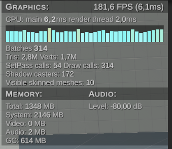
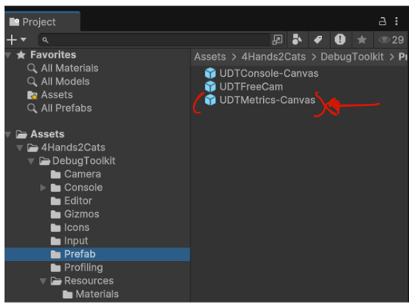

# Metrics

The metrics are enabled using the interactive console with the command :
> *metrics*/*Metrics*/*-m*/*-M* followed by *enable*/*e* or *disable*/*d* to enable or disable the metrics.

The Graphics section displays the FPS and the time elapsed since the last frame.
It also shows the time spent by the Main thread and a breakdown of the time taken by the Render thread. The graph represents the time spent by the main thread, targeting 120 FPS.
Additionally, this section includes:

    The number of batches
    The number of triangles
    The number of vertices
    The number of SetPass calls
    The number of draw calls
    The number of shadow casters
    The number of visible skinned meshes

The Memory section displays the total memory usage across:

    Engine
    System
    Video
    Audio
    Garbage collection

The Audio section shows the current audio level.

To adjust the update rate of the metrics, modify the Update Delta Time parameter in the metrics prefab:

    Increase the value to reduce the update frequency.
    Decrease the value to increase the update frequency.

You can use the metrics as a stand alone feature by drag and dropping it in your scene. 

> Note : If you use the metrics as a standalone feature, it'll not be managed by the console anymore.