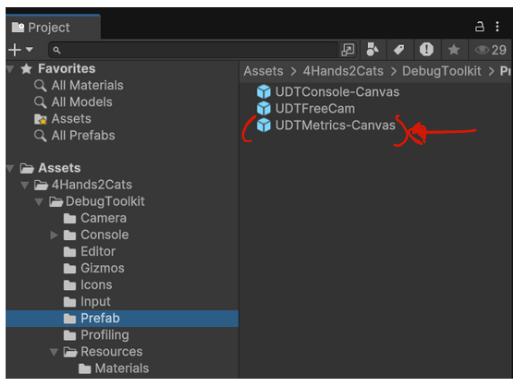

# Metrics

The metrics are enabled using the interactive console with the command :
> *metrics*/*Metrics*/*-m*/*-M* followed by *enable*/*e* or *disable*/*d* to enable or disable the metrics.

For now it show the FPS, the number of batches, the number of tris and the number of vert. In future updates it'll help you to do some profiling.

You can use the metrics as a stand alone feature by drag and dropping it in your scene. 

> Note : If you use the metrics as a standalone feature, it'll note be managed by the console anymore.