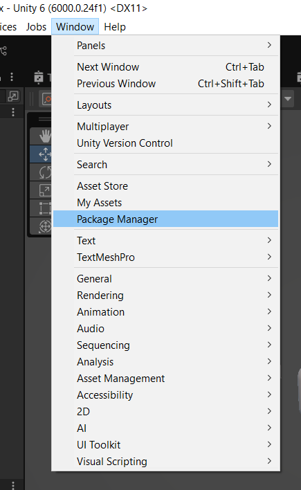

# Install UDT

> Make sure that you are using Unity 6 or above.

## Package manager
Get into the unity package manager at the top of the Unity Engine window and look for UDT in your assets 

Click on the **download** button at the bottom right of the menu.

Once the files are downloaded, import them in your project by clicking on the **Import** button.