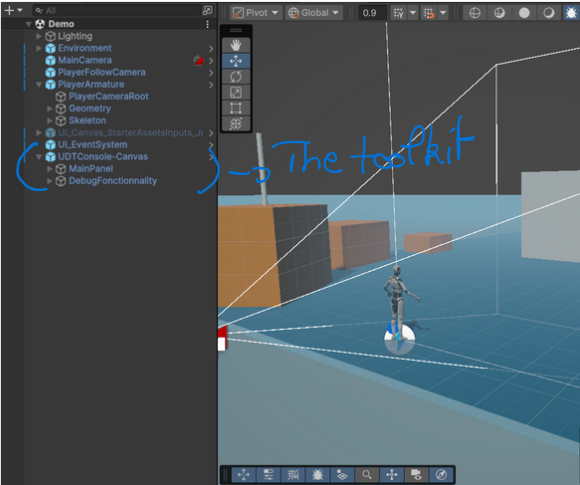

# Demo Scene Tour

We provide three demo scenes to help you quickly explore and test the features of the toolkit in different contexts:

1. Third-Person 3D Demo

Based on Unity's third-person template, this scene showcases our debug toolkit in a 3D environment. It includes character movement, camera follow, and in-world interaction.
To use this demo scene just press play. The Console and the all the other features are on the **F12** key. 
    Controls:
    Use **WSDQ** to move the character, the mouse to control the camera, and press F12 to toggle the debug console and other tools.

2. 2D Demo Scene

This lightweight scene is designed to demonstrate the toolkit in a 2D context. It’s ideal for side-scrollers, top-down games, or any 2D project.
To use this demo scene just press play. The Console and the all the other features are on the **F12** key. 

3. Mobile Demo Scene

Tailored for touchscreen interaction, this scene demonstrates how the toolkit behaves on mobile devices. It includes on-screen controls and supports both portrait and landscape modes.
To use this demo scene just press play. The Console and the all the other features are on the **F12** key. 
    Controls:
    Use the on screen controller to move the character and control the camera.

Each scene is plug-and-play ready—just open the one you need and press Play in the Unity Editor. You can easily customize them or use them as a starting point for your own testing environments.