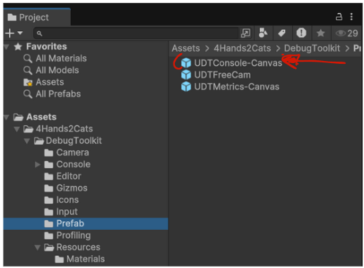

# Quick Start

As you just seen in the demo scene, the toolkit is pretty simple to include in your project. You just have to drag and drop the **UDTConsole-Standalone** prefab from the prefab folder inside your scene. 
Alternatively, use the **UDTConsole-Mobile** for your mobile project (Android/IOS).

Don't forget to remove it for production builds. 
